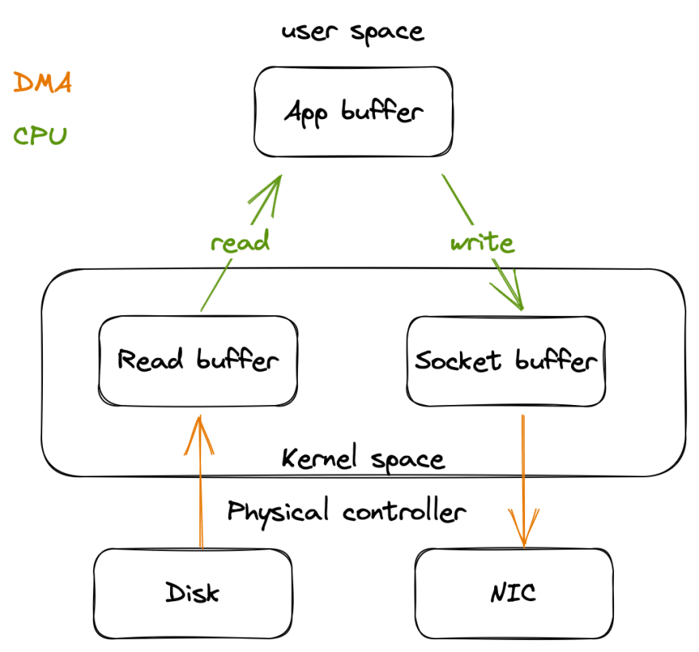

# In Memory DB

## How does Listen System call works:
 - **Does listen system call loops infinitely over the TCP connection network buffer ?**
   - The listen system call in the context of TCP (Transmission Control Protocol) does not loop infinitely over the TCP connection network buffer. Instead, the listen system call prepares a socket to accept incoming connections on a specific port, and it sets the socket's status to "listening." It doesn't directly deal with the network buffer.
     - Here's how it works:
        - **Setting up the Socket**: When a program calls the socket system call to create a socket, it specifies the type of socket (e.g., SOCK_STREAM for TCP) and other parameters. This socket is then associated with a local endpoint, typically an IP address and port.
        - **Binding:** After creating the socket, the program typically calls the bind system call to associate the socket with a specific local address and port. This is the address to which clients will connect.
        - **Listening**: Once the socket is bound, the program calls the listen system call. This sets up the socket to accept incoming connections on the specified local address and port. The socket transitions to a "listening" state.
        - **Accepting Connections:** After the socket is in the listening state, the program usually enters a loop, repeatedly calling the accept system call. The accept call blocks until a client initiates a connection.
        - **Accepting a Connection:** When a connection request arrives from a client, the accept system call returns a new socket. This new socket represents the established connection to that client.
        - **Handling Data:** The program can use this new socket to read data sent by the client or write data to the client. This is where data is transferred between the server and the client.
        - **Closing the Connection:** When the server is done with a particular client, it closes the socket associated with that client to terminate the connection. The server can continue to accept new connections and handle them in a similar manner.
   - The network buffer management, which involves reading and writing data to and from the network, is typically handled at a lower level by the networking stack of the operating system. The listen and accept system calls primarily deal with managing the status of the socket, accepting new connections, and providing a new socket for communication once a connection is established.
   - In summary, the listen system call doesn't loop infinitely over the TCP connection network buffer; rather, it prepares the socket to accept incoming connections, and the actual data transfer occurs through separate socket operations like read and write. The operating system's networking stack manages the network buffers to ensure data is sent and received reliably.

##  **Command to send request to the server:**
   - Establish Connection:
     - nc localhost 7379

## Install Redis CLI
   - **MAC**:
     - brew tap ringohub/redis-cli
     - brew update && brew doctor 
     - brew install redis-cli
   - **Ubuntu**:
     - sudo apt-get update
     - sudo apt install redis-tools

   - Output of REDIS CLI when it connects to the echo server, on server console
      
       - This is the serialization protocol of REDIS , clients doesn't connect to REDIS over HTTP , but it happens over raw TCP, so there has to be some protocol based on which the client and REDIS server can communicate.
  
## Datatypes
    - string , int, array
    - binary string

## REDIS serialization Protocol (RESP)
 - **RESP**:
   - Request Response Protocol
   - https://redis.io/docs/reference/protocol-spec/#:~:text=RESP%20can%20serialize%20different%20data,that%20the%20server%20should%20execute
   - It is light weight as compared to JSON
   - _Commands are sent by redis client as an array of strings serialised using RESP._
   - Every data type starts with a special character
   - Data ends with \r\n (CRLF)
     - Eg: 
       - Sending a **string** pong to redis : `+pong\r\n`
       - Sending an **int**: `:1720\r\n`
       - **Bulk Strings**: `$4\r\npong\r\n`
         - Starts with $
         - 4 is the number of bytes in the string.
         - Bulk strings are binary safe, simple strings cannot contain \r\n in the string itself as they are the terminators for the end of string
         - With bulk string we can store any binary data in redis.
         - Null value: `$-1\r\n` (-1 tells no data)
       - **Array**: `["a",200,"cat]`
         - Starts with * 
         - RESP encoding of above array:
         - `*3\r\n
            $1\r\na\r\n
            :200\r\n
            $3\r\ncat\r\n`
         - empty array : `*0\r\n`
         - null array : `*-1\r\n`
       - **Error**:
         - Starts with -
         - `- Key Not Found \r\n`

## Running the first command with redis cli
 - Running Ping command
   - redis-cli -p 7379
   - > ping
     > 

## IO Multiplexing
 - Event Loop is all about accessing IO using system calls like EPOLL, POLL , SELECT
 - EPOLL equivalents:
   - MAC: KQUEUE
   - WIN: IOCP
 - EPOLL: https://copyconstruct.medium.com/the-method-to-epolls-madness-d9d2d6378642
 - **How data is red from disk or NIC in a process:**
   - 
   - **From DISK:**
     - Process requests a file from disk
     - Data moved from DISK in blocks to os buffer (DMA)
     - From OS buffer to User space process memory or process read buffer
   - **From Network** 
     - Data comes to NIC, OS pulls data to Socket OS buffer (DMA)
     - Data then moves from socket buffer to user space process read buffer.
 - System calls to work with EPOLL:
   - create an epoller instance:
     - epoll_create1
   - Register all FD's to EPOLL instance:
     - epoll_ctl passing all FD's
   - Wait for some data to be ready on the registered FD's
     - epoll_wait
   - 